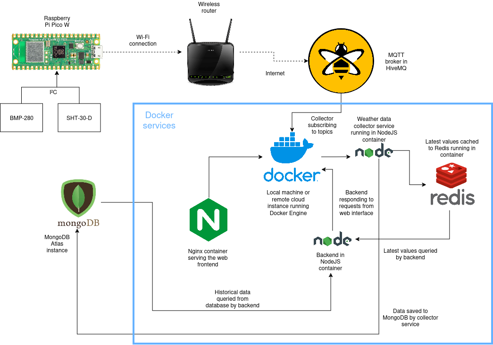

# Project repository for Internet of Things course

This repository contains files and source code for a weather station project done in course Internet of Things at university of Oulu.

## Contents

Listing of folders and their contents

- `/lib` - Libraries needed for Pico to run the weather station
- `/src` - Micropython source code for Pico
- `/web` - Services that enable the web interface and backend services to process sensor data

## Architecture diagram



## Configuration setup for Pico

1. Copy the `config.template.py` file to `config.py`:

   ```bash
   copy config.template.py config.py
   ```

2. Setup HiveMQ Cloud account: https://console.hivemq.cloud/

   - Create new account and cluster
   - Go to Access Management and add new credentials
     - Set permission to PUBLISH_SUBSCRIBE
   - Go to Overview and copy the MQTT broker URL
   - Go to Web Client tab and connect to the MQTT broker
   - Add Topic Subscriptions
     - sensors/temperature_in
     - sensors/temperature_out

3. Update the `config.py` to reflect your personal configurations.

   ```plaintext
   ssid = ''  # WiFi name
   pwd = ''   # WiFi password
   MQTT_BROKER = ''  # MQTT broker URL
   MQTT_PORT = 8883  # Default MQTT port
   MQTT_USER = ''  # MQTT username
   MQTT_PWD = ''   # MQTT password
   ```

4. Upload the files to Pico.

- `/lib` folder
- main.py
- config.py

5. Run `main.py` with Thonny IDE or other MicroPython IDE.
