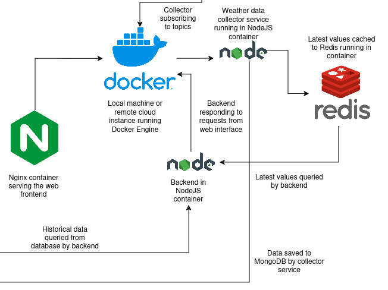

This folder contains documentation and code for the frontend and backend services which make it possible to view the weather data from the station via a webpage.

General descriptions of the services can be found below.

**backend**

A service which integrates with MongoDB and Redis cache to provide access to real-time and historical data through an API.

**frontend**

This service provides a web page which fetches and displays data from the API provided by the backend service.

**weather-collector**

weather-collector connects to HiveMQ Cloud service, and receives sensor data through MQTT topics. After receiving this data, it caches the values to Redis, and also saves them to MondoDB for later use.

**weather-notifier**

`weather-notifier` is an optional extra service to which the frontend can connect to get live updates to sensor data. This service receives messages through Redis pub/sub interface when new data arrives to the collector service. It accepts and maintains WebSocket connections from clients. Whenever new data values arrive to the collector service, `weather-notifier` sends the backend API endpoint from which the new value can be queried to all of the currently connected clients.

An up-to-date architecture diagram of the described services is provided below.

